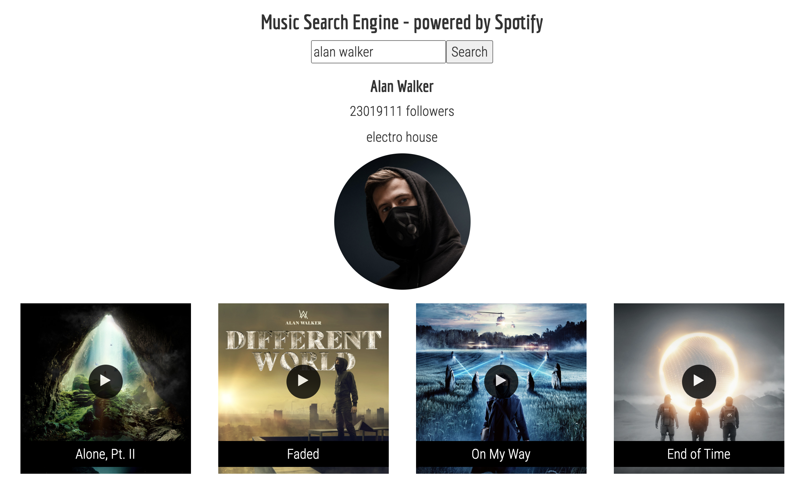

# Music engine

## Overview
This React App is a search engine of music artists. It allows users to specify an artist, and then returns basic information of the artist and his/her most popular tracks. All data is extracted from Spotify via a wrapped API.

## Setup
In the folder of `music-engine`, 

run 
```
npm i
```

Then run
```
npm start
```

## Examples
The user interface looks like:


Here is an example returned by this music engine:



Click the <span>&#9654;</span> button in the center of album pictures, and you will hear the sound track.
